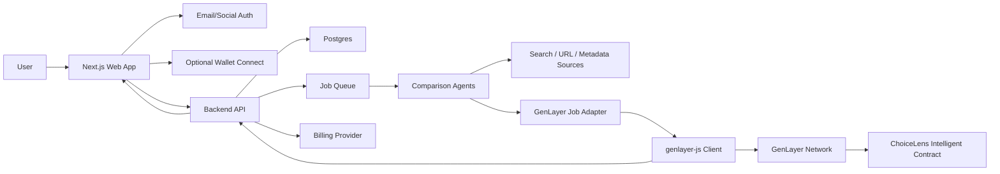

# Architecture 01: Web2-First, Wallet-Optional

Status: recommended
Best for: broad consumer adoption

## 1. Summary

This architecture makes ChoiceLens feel like a normal consumer web app first and a
GenLayer-powered product second. Users can compare choices as guests, create an
account with email/social login, and connect a wallet only when they want premium
features such as portable decision receipts, wallet-owned profiles, or on-chain
payment experiments.

This is the preferred V1 route because the target audience is "all users", not
only crypto users.

## 2. System Diagram

## 3. Core Components

### Web App

Recommended stack:

- Next.js App Router.
- TypeScript.
- Tailwind CSS or a component system chosen during implementation.
- TanStack Query for client server-state.
- Zustand or React context for local in-progress comparison state.

Responsibilities:

- Input prompt and option collection.
- Preference capture.
- Result display.
- Watchlist management.
- Plan/paywall surfaces.
- Optional wallet connection UI.

### Backend API

Recommended stack:

- Next.js API routes for V1 or a separate Node service if the queue grows.
- PostgreSQL.
- Redis for queues, rate limiting, and temporary guest sessions.
- Background worker for crawling, analysis, and GenLayer jobs.

Responsibilities:

- Normalize comparison requests.
- Enforce usage limits.
- Manage user-owned data.
- Run analysis jobs.
- Create and poll GenLayer transactions.
- Store receipt metadata.
- Send watchlist alerts.

### Comparison Agents

Use multiple off-chain agents first for speed and cost control:

- Value analyst: price-to-benefit trade-off.
- Fit analyst: match against personal preferences.
- Risk analyst: hidden risks, weak warranties, lock-in, safety issues.
- Evidence analyst: source quality and uncertainty.
- Longevity analyst: usefulness over time.

The agents produce structured JSON that can be summarized by the backend and, when
needed, sent to GenLayer for consensus-backed finalization.

### GenLayer Adapter

The adapter hides GenLayer details behind a stable internal service API:

- `createDecisionReceipt(requestId)`
- `getReceiptStatus(receiptId)`
- `readDecisionReceipt(receiptId)`
- `submitWatchlistReevaluation(watchlistItemId)`

It uses `genlayer-js` to create clients, read contract state, write transactions,
wait for receipts, and debug transaction failures.

### Intelligent Contract

The contract should not store private prompts. It should store:

- Hash of comparison payload.
- Public-safe category.
- Scoring schema version.
- Final recommendation hash.
- Confidence band.
- Timestamp / block context.
- Optional public explanation summary.

Private raw inputs remain in the app database.

## 4. User Flows

### Guest Compare

1. User enters a comparison request.
2. Backend creates a guest session.
3. Agents run off-chain.
4. User sees a result.
5. User can sign up to save it.

No wallet and no GenLayer transaction required.

### Paid Receipt

1. User creates a comparison.
2. User clicks "Create decision receipt".
3. App asks user to connect wallet if not already connected.
4. Backend prepares receipt payload hash.
5. Frontend uses wallet-aware GenLayer client to write to the contract.
6. Backend polls finality and updates UI.

### Watchlist

1. User saves a decision to watchlist.
2. Worker checks selected signals on schedule.
3. If material change is detected, off-chain agents re-run.
4. Premium users can request a GenLayer-backed update receipt.
5. User receives email/app notification.

## 5. Wallet Strategy

Wallet is optional. The app should support:

- No wallet for guest/free flow.
- Email/social account for mainstream users.
- RainbowKit for wallet connection when desired.
- wagmi hooks for wallet state in React.
- viem for lower-level typed EVM operations.
- `genlayer-js` for GenLayer reads/writes.

Wallet unlocks:

- Receipt creation.
- Wallet-linked premium identity.
- Potential crypto payment experiments.
- Portable decision ownership.

Wallet must not block:

- First comparison.
- Reading public shared results.
- Creating a normal account.
- Paying via fiat subscription.

## 6. GenLayer Integration Pattern

Use two clients:

- Read client: no wallet required, used for reads and receipt polling.
- Write client: wallet/provider/account required, used for user-signed writes.

This follows the official GenLayerJS browser dApp guidance: separate read concerns
from wallet-signed writes and switch wallet networks before write calls.

Initial networks:

- Localnet for development.
- Studionet for early integration.
- Testnet Bradbury or Asimov for public beta, depending on current availability.

## 7. Data Boundaries

Off-chain:

- Prompt.
- User preferences.
- Full evidence snapshots.
- Raw source extracts.
- Payment and subscription state.
- Private result history.

On-chain / GenLayer:

- Payload hash.
- Decision schema version.
- Public-safe score digest.
- Receipt transaction.
- Optional public summary.

## 8. API Surface

### App API

- `POST /api/comparisons`
- `GET /api/comparisons/:id`
- `POST /api/comparisons/:id/refine`
- `POST /api/comparisons/:id/receipt`
- `GET /api/receipts/:id`
- `POST /api/watchlist`
- `GET /api/watchlist`
- `PATCH /api/watchlist/:id`
- `POST /api/billing/checkout`
- `POST /api/billing/webhook`

### Internal Worker API

- `runComparisonAnalysis`
- `refreshWatchlistItem`
- `submitGenLayerReceipt`
- `pollGenLayerReceipt`
- `calculateUsageCost`

## 9. Subscription and Monetization

Free users:

- Limited comparisons.
- Limited watchlist.
- No GenLayer receipts or limited trial receipts.

Plus users:

- More comparisons.
- Saved profile.
- Watchlist alerts.
- Limited monthly receipts.

Pro users:

- Bulk import.
- Advanced weights.
- Priority jobs.
- More receipts.
- Export.

## 10. Risks

- Users may not understand why GenLayer matters.
- GenLayer jobs may be slower than consumer expectations.
- Watchlist can become expensive if not throttled.
- Broad category support can produce shallow results.
- Affiliate revenue can damage trust.

## 11. Mitigations

- Use GenLayer only for premium receipt/finality moments.
- Make off-chain results fast and useful.
- Add per-category templates gradually.
- Limit watchlist frequency by plan.
- Label monetized links and keep ranking independent.
- Store public-safe hashes instead of private prompts on-chain.

## 12. Testing Plan

- Unit test input parsing and scoring.
- Integration test API and queue.
- Mock GenLayer adapter in most app tests.
- Run real localnet/studionet GenLayer tests in CI nightly.
- Playwright test wallet disconnected and connected flows.
- Test network mismatch and wallet rejection.
- Test paid quota boundaries.

## 13. Production Readiness Checklist

- Auth and billing stable.
- GenLayer job failures recoverable.
- Wallet connection and network switching tested.
- Receipt status shown clearly.
- Private data never written to chain.
- Admin dashboard shows job cost and failures.
- Watchlist alerts can be paused.
- Rate limits and abuse controls enabled.

## 14. When to Choose This Architecture

Choose this if the goal is a product that normal users can try immediately,
monetize with subscriptions, and later expand into deeper web3 features without
forcing wallet onboarding on day one.

