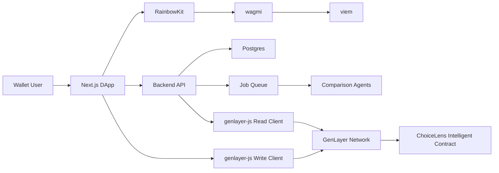

# Architecture 02: Wallet-First DApp

Status: alternative
Best for: crypto-native positioning and portable ownership

## 1. Summary

This architecture makes wallet identity the primary account system. Users connect a
wallet before creating saved comparisons, receipts, watchlists, or premium state.
It makes the product more web3-native and easier to align with GenLayer from the
first screen, but it adds onboarding friction for mainstream users.

This route is not recommended for broad consumer V1, but it may be useful if the
project is launched for crypto communities first.

## 2. System Diagram

## 3. Core Components

### DApp Frontend

Responsibilities:

- Wallet connection before personalized features.
- SIWE or wallet signature authentication.
- On-chain receipt creation from the user wallet.
- User profile bound to wallet address.
- Comparison and watchlist UI.

### Backend API

Responsibilities:

- Store off-chain private data.
- Verify wallet signatures.
- Manage plan access.
- Run background analysis.
- Poll GenLayer transaction status.

### Intelligent Contract

The contract becomes more central than in Architecture 01:

- Stores decision receipt records by wallet.
- Stores user-owned preference profile pointers.
- Stores watchlist digest metadata for premium users.
- Emits events for receipts and reevaluations.

Private data remains off-chain and is referenced by hash.

## 4. Wallet Authentication

Recommended stack:

- RainbowKit for wallet connection.
- wagmi for React wallet state and actions.
- viem for typed signing and wallet utilities.
- Optional SIWE with NextAuth for session creation.

Flow:

1. User connects wallet.
2. App asks for message signature.
3. Backend verifies signature and creates session.
4. User can create comparisons and receipts.

## 5. GenLayer Interaction Model

Reads:

- Backend uses read client for public receipt data.
- Frontend can also read public receipt state directly.

Writes:

- User wallet signs write operations from the frontend.
- App calls `client.connect(networkName)` before write operations when needed.
- App waits for accepted status first, then finality for permanent UI state.

## 6. User Flows

### First Use

1. User lands on app.
2. User must connect wallet to start a saved comparison.
3. App asks for a short preference setup.
4. User creates comparison.
5. Off-chain agents produce draft result.
6. User signs transaction to create a receipt.

### Public Shared Result

1. Visitor opens result link.
2. App reads public digest and off-chain public page.
3. Visitor can view without wallet.
4. Visitor connects wallet to fork/save.

### Fork a Decision

1. User opens another user's public comparison.
2. User clicks "Fork for my preferences".
3. App uses the original digest as a starting point.
4. User signs a new receipt if they save the result.

## 7. Data Model Changes

User identity is keyed by wallet:

- `WalletUser`
- `WalletSession`
- `WalletPreferenceProfile`
- `OnchainDecisionReceipt`
- `OffchainDecisionPayload`

Email becomes optional for notifications, not the core identity.

## 8. Monetization

Possible monetization:

- Wallet-gated subscription NFT or pass.
- Crypto payment for receipt credits.
- Fiat subscription mapped to wallet address.
- Public decision boards with paid premium analytics.

For mainstream users, fiat subscription should still exist.

## 9. Advantages

- Strong GenLayer/web3 identity from day one.
- Natural ownership of receipts.
- Better fit for crypto communities.
- Easier wallet-based portability.
- Possible on-chain social graph and public comparison forks.

## 10. Disadvantages

- High onboarding friction for non-crypto users.
- More support burden around wallet issues.
- Harder SEO/conversion if primary action is connect wallet.
- Risk of overusing on-chain flows for consumer interactions.
- Payments and subscriptions become more complex.

## 11. Security Requirements

- Defend against signature replay.
- Use nonce-based SIWE messages.
- Never ask users to sign unclear messages.
- Show network and transaction purpose before writes.
- Protect against malicious pasted links and prompt injection.
- Store private data off-chain.
- Use strict access control for wallet-owned records.

## 12. Testing Plan

- Wallet connection matrix: MetaMask, WalletConnect, Coinbase Wallet.
- SIWE nonce and replay tests.
- Network switching tests.
- User rejection tests.
- Transaction accepted/finalized/failure tests.
- Contract event indexing tests.
- Public result access without wallet.

## 13. Production Readiness Checklist

- Wallet flows tested across major wallets.
- SIWE sessions secure.
- Network mismatch UI clear.
- All transactions have human-readable confirmation context.
- Support path exists for stuck transactions.
- Contract state migration plan exists.
- Indexer catches up after downtime.

## 14. When to Choose This Architecture

Choose this if the launch audience is crypto-native, GenLayer ecosystem adoption is
more important than broad consumer conversion, and the product wants to be known as
a wallet-owned decision graph from the beginning.

