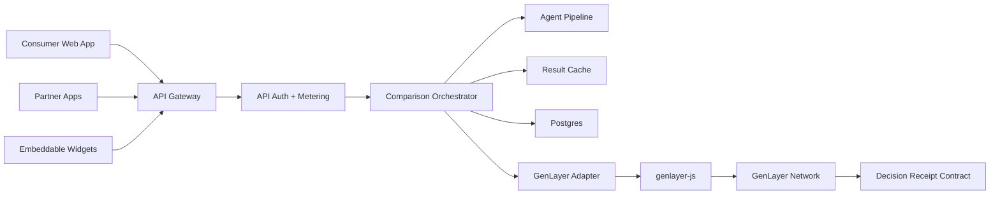

# Architecture 03: API-First Comparison Engine

Status: alternative
Best for: future platform and B2B2C monetization

## 1. Summary

This architecture treats ChoiceLens as a comparison intelligence API first and a
consumer app second. The web app exists as the first client, but the core product
is an API that can power widgets, browser extensions, partner websites, and
third-party apps.

This route is commercially attractive, but it is heavier for V1 because the team
must build developer experience, API reliability, documentation, auth, metering,
and consumer UX at the same time.

## 2. System Diagram

## 3. API Product Surface

### Public API

- `POST /v1/compare`
- `POST /v1/shortlist`
- `POST /v1/explain-fit`
- `POST /v1/watchlists`
- `GET /v1/watchlists/:id`
- `POST /v1/receipts`
- `GET /v1/receipts/:id`
- `GET /v1/usage`

### Webhooks

- `comparison.completed`
- `comparison.failed`
- `receipt.accepted`
- `receipt.finalized`
- `watchlist.changed`

### SDKs Later

- TypeScript SDK.
- Python SDK.
- React widget SDK.

## 4. Core Services

### API Gateway

Responsibilities:

- API key auth.
- Rate limiting.
- Request validation.
- Usage metering.
- Tenant isolation.
- Response shaping.

### Comparison Orchestrator

Responsibilities:

- Normalize request schema.
- Select category pipeline.
- Check cache.
- Queue agent jobs.
- Trigger GenLayer adapter if requested.
- Persist structured results.

### Agent Pipeline

Responsibilities:

- Source gathering.
- Option normalization.
- Multi-perspective scoring.
- Explanation generation.
- Confidence and uncertainty calculation.

### GenLayer Adapter

Responsibilities:

- Submit receipt jobs.
- Read contract state.
- Wait for accepted/finalized transaction receipts.
- Handle transaction errors.
- Return transaction metadata to API callers.

### Developer Portal

Responsibilities:

- API key management.
- Usage dashboard.
- Billing.
- Logs and request replay.
- API docs.

## 5. Consumer Web App Role

The web app is not the whole product. It becomes:

- Demo of API capability.
- Main consumer acquisition channel.
- Testing ground for new comparison flows.
- Self-serve dashboard for individual users.

The same internal API powers the web app and external customers.

## 6. GenLayer Integration Model

Partner requests can choose:

- `consensus: "none"` for fast off-chain comparison.
- `consensus: "receipt"` for a GenLayer-backed digest.
- `consensus: "full"` for higher-cost multi-validator reasoning.

V1 should expose only `none` and `receipt` internally. Public `full` mode should
wait until costs, latency, and reliability are well understood.

## 7. Tenant Model

Each API customer has:

- tenant id,
- API keys,
- usage quota,
- billing plan,
- allowed domains,
- webhook secrets,
- data retention settings,
- GenLayer receipt limits.

Consumer users can be treated as a first-party tenant.

## 8. Monetization

Revenue options:

- Consumer subscription.
- API usage pricing.
- Partner widget subscription.
- Premium receipt credits.
- Enterprise plan for higher throughput and data retention.

Suggested API pricing model:

- Free developer tier with low limits.
- Starter monthly plan with included comparisons.
- Usage-based overage.
- Receipt credits billed separately due to GenLayer cost.

## 9. Advantages

- Strong business model beyond consumer subscriptions.
- Reusable core engine.
- Easier to create browser extension and widgets later.
- Clear API metering and enterprise path.
- Can become infrastructure for comparison experiences.

## 10. Disadvantages

- Heavy V1 scope.
- More reliability burden.
- Requires developer docs and support.
- Consumer UX may receive less attention.
- API customers may demand category depth too early.

## 11. Security Requirements

- API key rotation.
- Webhook signing.
- Tenant-scoped access checks.
- Request and response PII controls.
- Abuse and scraping detection.
- Prompt injection filtering for partner-provided content.
- Separate rate limits for source fetching and GenLayer jobs.

## 12. Testing Plan

- API schema contract tests.
- Rate-limit tests.
- Tenant isolation tests.
- Webhook delivery retry tests.
- SDK smoke tests.
- Load tests for compare endpoint.
- GenLayer adapter integration tests.
- Billing usage reconciliation tests.

## 13. Production Readiness Checklist

- Public API docs complete.
- API keys and webhooks secure.
- Usage metering reconciles with billing.
- SLOs defined for API latency and uptime.
- GenLayer jobs are queued, capped, and observable.
- Tenant data deletion works.
- Support tooling exists for failed API requests.

## 14. When to Choose This Architecture

Choose this if the main goal is to build a comparison infrastructure business, not
only a consumer app. It is best after the team validates the comparison experience
with real users or if the founder already has API distribution partners.

